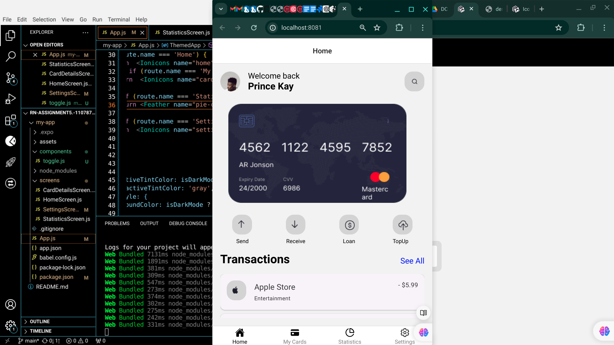
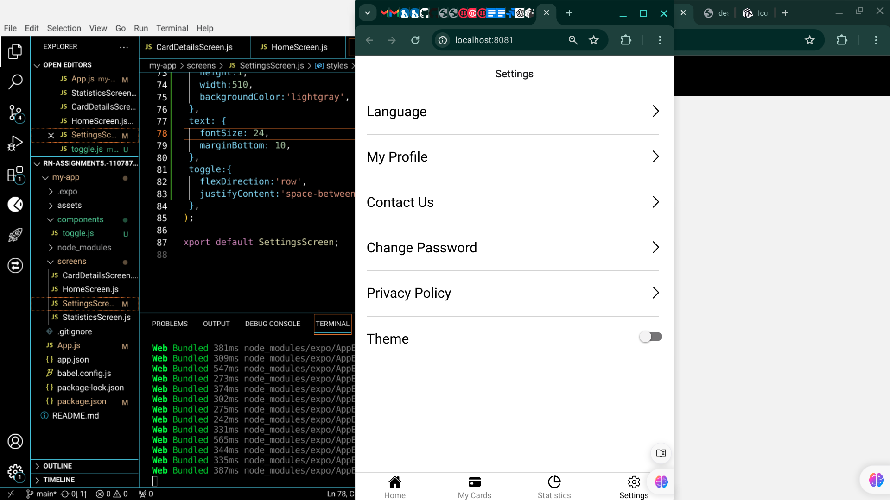

# rn-assignment5.-11078728

# React Native App with Tab Navigation and Theme Toggle

This project is a React Native application featuring bottom tab navigation, a settings screen with a dark/light mode toggle, and centered tab headings. It uses `react-navigation` for navigation and `react-native-vector-icons` for icons.

## Features

- Bottom tab navigation with icons
- Centered tab headings
- Dark mode and light mode toggle in the settings screen
- Responsive design with theme support

## Getting Started

These instructions will help you set up and run the project on your local machine for development and testing purposes.

### Prerequisites

- Node.js (v14 or later)
- npm or yarn
- Expo CLI (if using Expo)

### Installation

1. Clone the repository:
   ```sh
   git clone https://github.com/Pkay28748/rn-assignment5.-11078728.git
   cd rn-assignment5.-11078728

2. Install Dependencies : npm install  or yarn install
3. Install Additional Dependencies:
    npm install @react-navigation/native @react-navigation/bottom-tabs react-native-vector-icons
    npm install react-native-screens react-native-safe-area-context

## Running the App

1. Start the metro bundler:
    npm start or expo start

2. Running the app on an Android, IOS , or the web
    npm run android
    npm run iOs
    npm run web

## Project Structure
├── screens
│   ├── HomeScreen.js
│   ├── CardDetailsScreen.js
│   ├── StatisticsScreen.js
│   └── SettingsScreen.js
├── Assets
├── Components/toggle.js
├── App.js
├── Screenshot Images 
└── README.md
NB : For implementation details see the actual code .

## Screenshots 

1 Light mode 
3 Settings  
2 Dark mode  

## License
This project is licensed under the MIT License - see the LICENSE file for details.


